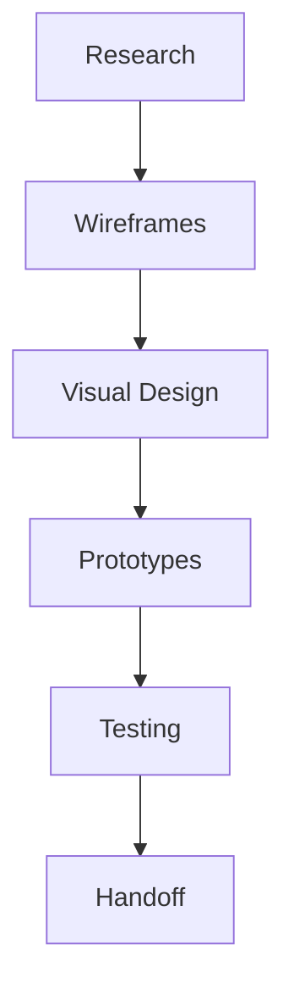

## Overview

OASIS empowers your business with comprehensive design and development services. Led by Harvey, a hybrid designer with over 5 years of experience, OASIS bridges business goals and user needs. You receive strategy, design, and development across web and mobile platforms, solving real problems through clean, delightful experiences. With 45+ completed projects and 12+ satisfied clients in fintech, delivery, and edtech, OASIS delivers measurable results.

## Key Features

Discover the core capabilities that set OASIS apart.

<Columns cols={3}>
  <Card title="Strategy Sessions" icon="target" href="#strategy">
    Align your business objectives with user expectations through collaborative workshops.
  </Card>
  <Card title="Design Process" icon="edit-3" href="#design">
    From wireframes to interactive prototypes, create user-centered designs.
  </Card>
  <Card title="Development Services" icon="code" href="#development">
    Build scalable apps for web and mobile with modern technologies.
  </Card>
  <Card title="Proven Results" icon="award" href="#case-studies">
    Explore 45+ projects and success stories from 12+ clients.
  </Card>
</Columns>

## Strategy Sessions

Kickstart your project with tailored strategy sessions. You collaborate with Harvey to define goals, identify pain points, and map user journeys. These sessions ensure every design decision supports your business objectives.

<Callout kind="tip">
  Schedule an initial 2-hour discovery call to uncover opportunities and set clear milestones.
</Callout>

## Design Process

Follow a structured, iterative design workflow that delivers polished results.

<Steps>
  <Step title="Research & Wireframing" icon="search">
    Gather requirements and create low-fidelity wireframes to outline structure.
  </Step>
  <Step title="Visual Design" icon="palette">
    Develop high-fidelity mockups with your brand colors, like `#040404` for OASIS.
  </Step>
  <Step title="Prototyping & Testing" icon="smartphone">
    Build interactive prototypes and conduct user testing for refinements.
  </Step>
  <Step title="Handoff" icon="git-branch">
    Deliver design assets and specifications for seamless development.
  </Step>
</Steps>



## Development Services

OASIS handles full-stack development across platforms. Choose the right approach for your needs.

<Tabs>
  <Tab title="Web" icon="globe">
    Build responsive web apps with React and Next.js.
    
    <CodeGroup tabs="React,Next.js">
    ````tsx
    // React component example
    function Dashboard() {
      return (
        <div className="p-6 bg-gray-900 text-white">
          <h1>OASIS Dashboard</h1>
          <p>Welcome to your tailored experience.</p>
        </div>
      );
    }
    ````
    ````tsx
    // Next.js page example
    export default function Home() {
      return (
        <main style={{ backgroundColor: '#040404' }}>
          <h1>OASIS Web App</h1>
        </main>
      );
    }
    ````
    </CodeGroup>
  </Tab>
  <Tab title="Mobile" icon="smartphone">
    Develop cross-platform apps with React Native.
    
    <CodeGroup tabs="iOS,Android">
    ````tsx
    // React Native screen
    import { View, Text } from 'react-native';
    
    export default function HomeScreen() {
      return (
        <View style={{ flex: 1, justifyContent: 'center', alignItems: 'center', backgroundColor: '#040404' }}>
          <Text style={{ color: 'white' }}>OASIS Mobile</Text>
        </View>
      );
    }
    ````
    ````tsx
    // Shared mobile logic
    const App = () => {
      return <HomeScreen />;
    };
    ````
    </CodeGroup>
  </Tab>
</Tabs>

## Case Studies and Success Stories

Dive into real-world examples from OASIS projects.

<ExpandableGroup>
  <Expandable title="Fintech App Redesign" default-open="true">
    Transformed a legacy fintech dashboard into a modern, secure interface. Reduced user errors by 40% and boosted retention.
  </Expandable>
  <Expandable title="Delivery Platform" default-open="false">
    Designed and developed a real-time tracking app for a delivery service, handling 10k+ daily orders.
  </Expandable>
  <Expandable title="Edtech Learning Portal">
    Created an engaging platform for interactive courses, serving 5k+ students with personalized paths.
  </Expandable>
</ExpandableGroup>

<Callout kind="success">
  Join 12+ satisfied clients. Contact us to start your project today.
</Callout>