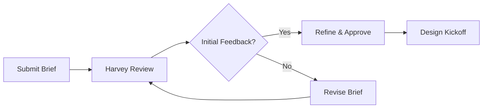

## Prerequisites

Before diving in, ensure you have the following ready:

<Callout kind="info">

- A business email address for account registration
- Project overview document outlining your goals and challenges
- Access to a modern web browser like Chrome or Firefox

</Callout>

## Create Your OASIS Account

Sign up in minutes to access Harvey Design's OASIS platform.

<Steps>
  <Step title="Visit the Signup Page" icon="external-link">
    Navigate to the OASIS dashboard at `https://dashboard.oasis.example.com/signup`.
  </Step>
  <Step title="Enter Your Details">
    Provide your name, email, company, and create a secure password.
  </Step>
  <Step title="Verify Email">
    Check your inbox for a verification link from `noreply@oasis.example.com` and click to activate.
  </Step>
  <Step title="Complete Onboarding">
    Answer a short questionnaire about your industry (fintech, edtech, etc.) and project scale.
  </Step>
</Steps>

## Schedule a Consultation

Book a free 30-minute call with Harvey to discuss your needs. Choose your preferred method.

<Tabs>
  <Tab title="Web Calendar" icon="calendar">
    <Steps>
      <Step title="Select Time" icon="clock">
        Go to `https://oasis.example.com/consultations` and pick an available slot.
      </Step>
      <Step title="Confirm">
        Fill in your project summary and submit.
      </Step>
    </Steps>
  </Tab>
  <Tab title="Email Request" icon="mail">
    Send details to `hello@harveydesign.com` with subject: "OASIS Consultation Request".
    
    Include:
    
    - Project timeline
    - Key challenges
    - Preferred meeting platform (Zoom, Google Meet)
  </Tab>
  <Tab title="Direct Message" icon="message-circle">
    Use the OASIS dashboard chat after login to message the Harvey Design team instantly.
  </Tab>
</Tabs>

<Callout kind="tip">
  Consultations are available Mon-Fri, 9 AM - 5 PM EST. Expect a response within 24 hours.
</Callout>

## Upload Project Requirements and Goals

Once onboarded, submit your brief to kickstart the design process.

<Steps>
  <Step title="Navigate to Projects" icon="folder">
    From the dashboard, click "New Project".
  </Step>
  <Step title="Upload Files">
    Drag and drop your requirements document, wireframes, or mood boards (PDF, PNG, up to 50MB).
  </Step>
  <Step title="Add Goals as JSON">
    Use the structured format for precise goals. Here's an example:
    
    <CodeGroup tabs="Basic,Advanced">
    ````json
    {
      "projectName": "Fintech Dashboard",
      "goals": ["Clean UX for mobile trading", "Integrate real-time data"],
      "targetUsers": "Traders aged 25-45",
      "timeline": "4 weeks",
      "budgetRange": "Medium"
    }
    ````
    
    ````json
    {
      "projectName": "Edtech Platform",
      "goals": ["Gamified learning paths", "Cross-platform responsive design"],
      "targetUsers": "Students K-12",
      "timeline": "6 weeks",
      "budgetRange": "High",
      "techStack": ["React", "Node.js"]
    }
    ````
    </CodeGroup>
  </Step>
</Steps>

## Basic Workflow for Design Briefs

Follow this streamlined process:



## Access Initial Resources

Get started with templates and guides.

<Columns cols={3}>
  <Card title="Design Brief Template" icon="file-text" href="https://oasis.example.com/resources/brief-template.docx">
    Download editable DOCX for project specs.
  </Card>
  <Card title="UX Audit Checklist" icon="check-square" href="https://oasis.example.com/resources/ux-checklist.pdf">
    Self-assess your current product.
  </Card>
  <Card title="Case Studies" icon="book-open" href="https://oasis.example.com/resources/cases">
    Review 45+ completed projects.
  </Card>
</Columns>

## Next Steps

<Callout kind="success">
  After submission, expect an initial response within 48 hours. Track progress in your dashboard.
</Callout>

Explore more in the [Introduction](/introduction) or dive into [Authentication](/authentication) for team invites.